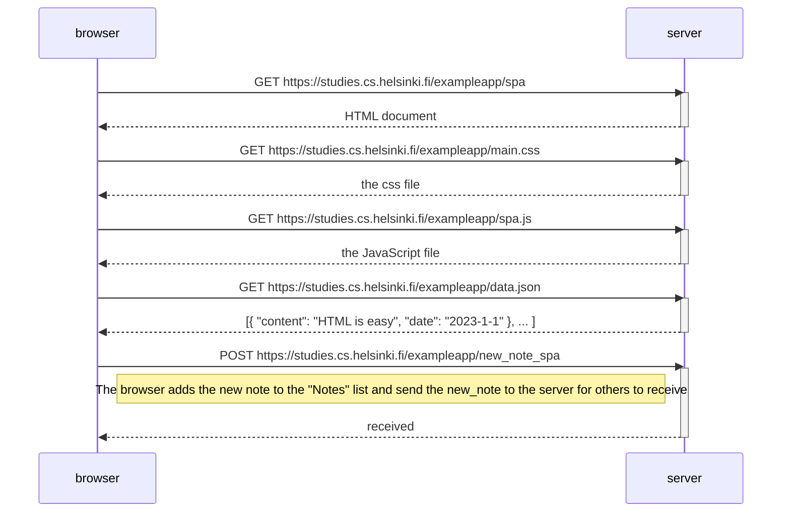

# 0.6: Uusi muistiinpano

The browser does not refresh the page every time.
 This means that the notes are added locally to the Notes list and that others notes won't show up on the Notes list because the browser doesn't fetch any new data from the server.

